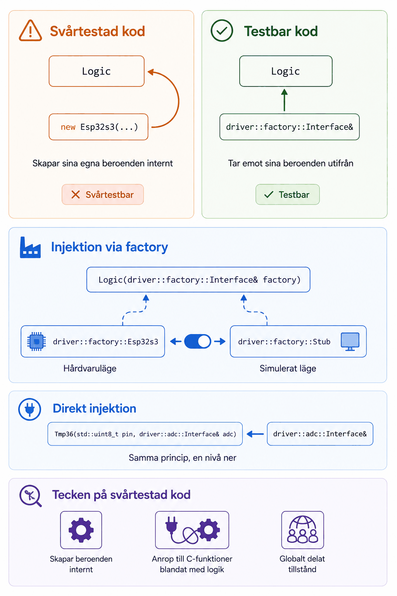

# Bilaga A - Testbar design



## Testbarhet är en designegenskap
I **L02–L04** stötte ni redan på gränsen för vad som gick att enhetstesta i er egen kodbas: era
stubbar gick att testa direkt, medan de riktiga `Esp32s3`-drivers, som anropar ESP-IDF, inte
gjorde det (ännu). Den gränsen är inte en naturlag, den är ett resultat av hur kodbasen är
designad. Att `driver::gpio::Stub` över huvud taget kan användas i stället för
`driver::gpio::Esp32s3` beror på att båda ärver samma interface, och att koden som använder dem
(`system::logic::Logic`) aldrig känner till skillnaden.

---

## Tecken på svårtestad kod
Några vanliga mönster som gör en klass svår att enhetstesta:
* **Klassen skapar sina egna beroenden internt**, t.ex. genom att instansiera en driver direkt
  i sin konstruktor eller i en metod, i stället för att ta emot den utifrån.
* **Direkta anrop till ESP-IDF:s C-funktioner blandas med beslutslogik** i samma funktion, som
  ni redan sett i GPIO-, seriell- samt timer-drivers.
* **Globalt eller statiskt delat tillstånd**, som gör att ett tests resultat kan påverkas av
  vilka andra tester som körts innan det.

Er kodbas från **P02** är designad för att undvika just dessa fällor: `system::logic::Logic` tar
emot en `driver::factory::Interface&` i konstruktorn och skapar sina drivers genom den, i stället
för att instansiera dem direkt, och `driver::tempsensor::Tmp36` tar emot sin
`driver::adc::Interface&` via konstruktorn i stället för att skapa en egen ADC-instans internt.

---

## Lösningen: interface och dependency injection
Ett **interface** beskriver *vad* en klass ska kunna göra, utan att säga *hur*. En klass som
bara känner till interfacet, inte den konkreta implementationen, kan testas mot vilken
implementation som helst som uppfyller det interfacet, inklusive en enkel stubb.

**Dependency injection** innebär att en klass tar emot sina beroenden utifrån (vanligtvis via
konstruktorn), i stället för att skapa dem själv. Er kodbas använder detta på två nivåer:

```cpp
// Direkt injektion: Tmp36 tar emot sin ADC-instans via konstruktorn.
Tmp36(std::uint8_t pin, driver::adc::Interface& adc);

// Injektion via factory: Logic tar emot en factory och skapar sina egna drivers genom den,
// i stället för att veta vilken konkret driverklass som ska instansieras.
Logic(driver::factory::Interface& factory);
```

Tack vare det andra mönstret räcker det att skicka in `driver::factory::Esp32s3` respektive
`driver::factory::Stub` till `Logic` för att växla mellan hårdvaruläge och simulerat läge, utan
att `Logic` själv behöver ändras alls.

---

## Kodformattering med `clang-format`
Testbar design handlar om struktur i stort; `clang-format` löser samma problem i det små, genom
att göra formatteringen till något ingen behöver diskutera på en code review. Verktyget läser en
`.clang-format`-fil i repots rot och formaterar om koden efter den, deterministiskt och likadant
för alla i gruppen.

De två kommandon ni behöver:

```bash
clang-format --dry-run --Werror src/min_fil.cpp   # visa vad som skulle ändras, ändra inget
clang-format -i src/min_fil.cpp                   # skriv ändringarna till filen
```

För hela kodbasen finns [ci/format.sh](../../../ci/format.sh), som kör `clang-format` på all
C/C++-kod och `black` på alla Python-filer:

```bash
ci/format.sh          # formatera alla filer
ci/format.sh --check  # kontrollera utan att ändra, används i CI
```

Poängen med `--check` är att samma kontroll kan köras automatiskt vid varje push, så att
formatteringen aldrig hinner glida isär. Ni sätter upp den delen av pipelinen i **L13**.

---
