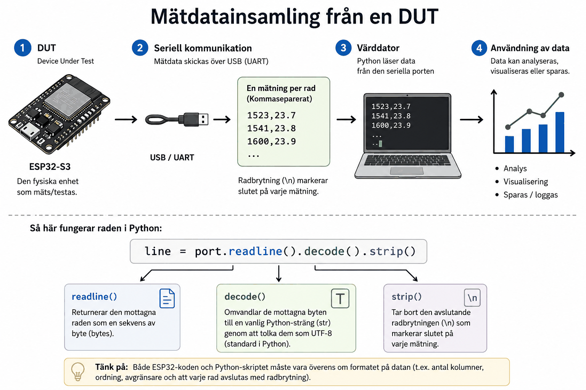

# Bilaga A - Mätdatainsamling från en DUT



## DUT: Device Under Test
En **DUT** är den fysiska enhet som testas eller mäts, i vårt fall er `ESP32-S3`. Till skillnad
från enhets- och komponenttester, som körs på värddatorn utan hårdvara, handlar
mätdatainsamling om att faktiskt hämta ut data från den riktiga, körande produkten.

---

## Ett enkelt, väldefinierat protokoll
För att värddatorn ska kunna tolka data som skickas över seriell kommunikation krävs ett
väldefinierat format, känt av båda sidor i förväg. Ett enkelt och vanligt val är
kommaseparerade rader, en mätning per rad, avslutad med radbrytning:

```
1523,23.7
1541,23.8
1600,23.9
```

Första kolumnen skulle till exempel kunna vara ett rått ADC-värde och den andra en
beräknad temperatur, men formatet i sig känner inte till vad kolumnerna betyder, det är en
överenskommelse mellan den som skriver `ESP32`-firmwaren och den som skriver Python-skriptet.

En kort, illustrativ läsning av sådana rader i Python med `pyserial` kan se ut så här:

```python
import serial

with serial.Serial("/dev/ttyUSB0", baudrate=115200, timeout=1) as port:
    while True:
        line = port.readline().decode().strip()
        if line:
            print(line)
```

**Noteringar:**
* `readline()` returnerar mottagna tecknen som en sekvens av bytes.
* `decode()` omvandlar de mottagna byten till en vanlig Python-sträng (`str`) genom att tolka dem som UTF-8 (standard i Python).
* `strip()` tar bort den avslutande radbrytningen (`\n`) som markerar slutet på varje mätning.

---
